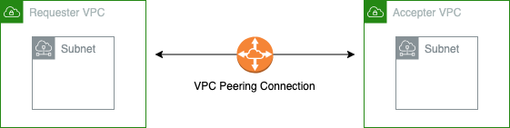

# **Using Terraform to Create an AWS VPC Peering**

Hi, Welcome to the first in the VPC Peering Series.

In this edition, you will learn how to create and peer VPCs together that are in the same region. This shows how to create VPC peering on AWS using terraform.
 
 

## __What is AWS VPC Peering?__
Amazon Web Services (AWS) Virtual Private Cloud (VPC) peering is a networking feature that allows you to connect two VPCs together, enabling communication between them as if they were on the same network. VPC peering is a private and secure connection, which means traffic between the peered VPCs stays within the AWS network and does not traverse the public internet.
 
 

 
 
 
 

## __CONCLUSION__
 
In conclusion VPC peering is useful for scenarios where you want to share resources, services, or data securely between separate VPCs, such as connecting development and production environments, sharing databases, or integrating different applications within your AWS infrastructure. It provides a convenient way to build complex multi-tier architectures in a scalable and isolated manner. As shown above, its shows the connection between 2 ec2 instances on different VPCs connecting with each other via the VPC Peering
